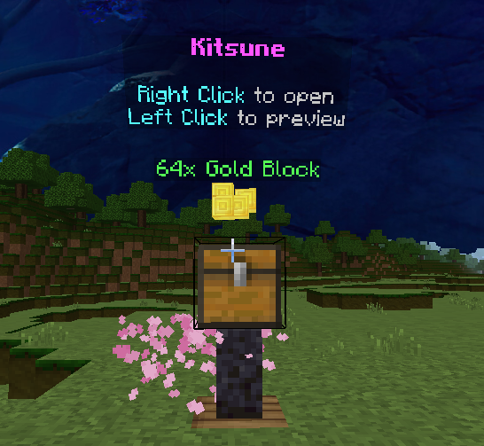
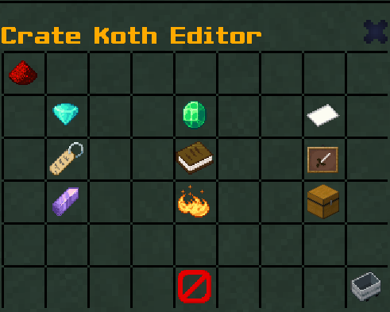

# SimpleCrates

**SimpleCrates is a PocketMine-MP plugin to add Crates on your server easy to edit in the game with /cr editor.**

<p align="center"></p>

<p align="center"></p>

## Prerequisites

- <a href="https://github.com/Muqsit/InvMenu">InvMenu virion</a>
- <a href="https://github.com/CortexPE/Commando">Commando virion</a>
- PMMP 5.19.0+

### Implementations

- [x] Easy Edit
- [x] Configure crate items from the server
- [x] Configure the representative crate block
- [x] Decorative particles by id or RGB
- [x] Floating items preview
- [x] Custom messages
- [x] Animations when opening the crate (can be disabled in config.yml)
- [x] Configurable key

## Installation & Setup

1. Install the plugin from [Poggit](https://poggit.pmmp.io/ci/RxDuZ/SimpleCrates/~).
2. (Optional) Configure `config.yml` customize the key and options available in the crate.
3. Restart your server.
4. Connect to your server.
5. Execute command `/crate create <crateName>` To create a new crate.
6. Execute command `/crate editor <crateName>` To open the edit menu.
7. Repeat with other crate types.

---

### 💾 Config

```yml
#  ███████╗██╗███╗   ███╗██████╗ ██╗     ███████╗ ██████╗██████╗  █████╗ ████████╗███████╗███████╗
#  ██╔════╝██║████╗ ████║██╔══██╗██║     ██╔════╝██╔════╝██╔══██╗██╔══██╗╚══██╔══╝██╔════╝██╔════╝
#  ███████╗██║██╔████╔██║██████╔╝██║     █████╗  ██║     ██████╔╝███████║   ██║   █████╗  ███████╗
#  ╚════██║██║██║╚██╔╝██║██╔═══╝ ██║     ██╔══╝  ██║     ██╔══██╗██╔══██║   ██║   ██╔══╝  ╚════██║
#  ███████║██║██║ ╚═╝ ██║██║     ███████╗███████╗╚██████╗██║  ██║██║  ██║   ██║   ███████╗███████║
#  ╚══════╝╚═╝╚═╝     ╚═╝╚═╝     ╚══════╝╚══════╝ ╚═════╝╚═╝  ╚═╝╚═╝  ╚═╝   ╚═╝   ╚══════╝╚══════╝
#
# SimpleCrates config by iRxDuZ ツ

# Do not touch :)
CONFIG_VERSION: 1

# Keys configuration
keys:
  id: "tripwire_hook"
  name: "§d{CRATE} Key"
  lore: "§eClaim rewards from a {CRATE} Crate"

# Crates configuration default
# Default blocks (chest, enchantment table, end portal frame, lime shulker box)
crates:
  blocks: ["chest", "enchant_table", "end_portal_frame", "lime_shulker_box"]
  animation: true
  duration: 5
  preview-items: true
  drop-item-time: 5
  particle: true
```

## Permissions

| Permissions                       | Description                      | Default |
| --------------------------------- | -------------------------------- | ------- |
| `simplecrates.command.crate`      | Allow to use /crate main command | `true`  |
| `simplecrates.command.create`     | Allow to create new crate        | `op`    |
| `simplecrates.command.delete`     | Allow to delete crate            | `op`    |
| `simplecrates.command.list`       | Allow to view crate list         | `op`    |
| `simplecrates.command.editor`     | Allow to Open crate menu editor  | `op`    |
| `simplecrates.command.renameitem` | Allow to Rename an item          | `op`    |
| `simplecrates.command.key`        | Allow to use /key command        | `op`    |
| `simplecrates.command.keyall`     | Allow to use /keyall command     | `op`    |

### ✔ Credits

| Authors        | Github                                         | Lib                                              |
| -------------- | ---------------------------------------------- | ------------------------------------------------ |
| Muqsit         | [Muqsit](https://github.com/Muqsit)            | [InvMenu](https://github.com/Muqsit/InvMenu)     |
| marshall       | [marshall](https://github.com/CortexPE)        | [Commando](https://github.com/CortexPE/Commando) |
| yuko fuyutsuki | [yuko fuyutsuki](https://github.com/fuyutsuki) | [Texter](https://github.com/fuyutsuki/Texter)    |
