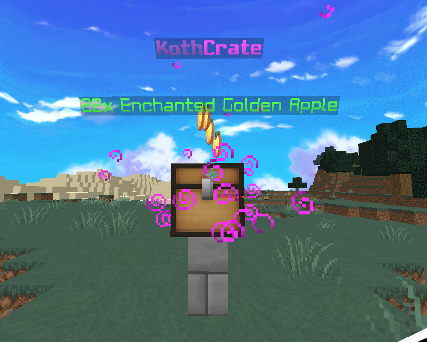

# SimpleCrates

**SimpleCrates is a PocketMine-MP plugin to add Crates on your server easy to edit in the game with /cr editor.**

<p align="center"></p>

<p align="center"></p>

## Prerequisites

- <a href="https://github.com/Muqsit/InvMenu">InvMenu virion</a>
- <a href="https://github.com/CortexPE/Commando">Commando virion</a>
- <a href="https://github.com/ifera-mc/ConfigUpdater">ConfigUpdater virion</a>
- PMMP 5.27.0+

### Implementations

- [x] Easy Edit
- [x] Configure crate items from the server
- [x] Configure the representative crate block
- [x] Decorative particles by id or RGB
- [x] Floating items preview
- [x] Custom messages
- [x] NEW Opening Animation (You can edit the values ​​in templates.yml)
- [x] NEW Allows you to skip the opening animation if you right-click with the key in hand and shift (You need to set the skip-animation-mode option to true in config.yml)
- [x] Configurable key

## Installation & Setup

1. Install the plugin from [Poggit](https://poggit.pmmp.io/ci/RxDuZ/SimpleCrates/~).
2. (Optional) Configure `config.yml` customize the key and options available in the crate.
3. Restart your server.
4. Connect to your server.
5. Execute command `/crate create <crateName>` To create a new crate.
6. Execute command `/crate editor <crateName>` To open the edit menu.
7. Repeat with other crate types.

---

### 💾 Config

```yml
#  ███████╗██╗███╗   ███╗██████╗ ██╗     ███████╗ ██████╗██████╗  █████╗ ████████╗███████╗███████╗
#  ██╔════╝██║████╗ ████║██╔══██╗██║     ██╔════╝██╔════╝██╔══██╗██╔══██╗╚══██╔══╝██╔════╝██╔════╝
#  ███████╗██║██╔████╔██║██████╔╝██║     █████╗  ██║     ██████╔╝███████║   ██║   █████╗  ███████╗
#  ╚════██║██║██║╚██╔╝██║██╔═══╝ ██║     ██╔══╝  ██║     ██╔══██╗██╔══██║   ██║   ██╔══╝  ╚════██║
#  ███████║██║██║ ╚═╝ ██║██║     ███████╗███████╗╚██████╗██║  ██║██║  ██║   ██║   ███████╗███████║
#  ╚══════╝╚═╝╚═╝     ╚═╝╚═╝     ╚══════╝╚══════╝ ╚═════╝╚═╝  ╚═╝╚═╝  ╚═╝   ╚═╝   ╚══════╝╚══════╝
#
# SimpleCrates config by iRxDuZ ツ

# Do not touch :)
CONFIG_VERSION: 2

# Keys configuration.
keys:
  id: "tripwire_hook" # Item key id.
  name: "§d{CRATE} Key" # Item key custom name.
  lore: "§eClaim rewards from a {CRATE} Crate" # Item key lore.

# Crates configuration.
crates:
  blocks: ["chest", "enchant_table", "end_portal_frame", "lime_shulker_box"] # Blocks allowed for crates.
  preview-items: true # Preview the content in item entities.
  drop-item-time: 5 # Time to change the item entity.
  skip-animation-mode: true # This option allows you to skip the opening animation if you right-click with the key in hand and shift.
```

## Permissions

| Permissions                         | Description                      | Default |
| ----------------------------------- | -------------------------------- | ------- |
| `simplecrates.command`              | Allow to use /crate main command | `true`  |
| `simplecrates.command.create`       | Allow to create new crate        | `op`    |
| `simplecrates.command.delete`       | Allow to delete crate            | `op`    |
| `simplecrates.command.list`         | Allow to view crate list         | `op`    |
| `simplecrates.command.reloadconfig` | Allow to reload all configs      | `op`    |
| `simplecrates.command.editor`       | Allow to Open crate menu editor  | `op`    |
| `simplecrates.command.renameitem`   | Allow to Rename an item          | `op`    |
| `simplecrates.command.key`          | Allow to use /key command        | `op`    |
| `simplecrates.command.keyall`       | Allow to use /keyall command     | `op`    |

### ✔ Credits

| Authors        | Github                                         | Lib                                                        |
| -------------- | ---------------------------------------------- | ---------------------------------------------------------- |
| Muqsit         | [Muqsit](https://github.com/Muqsit)            | [InvMenu](https://github.com/Muqsit/InvMenu)               |
| marshall       | [marshall](https://github.com/CortexPE)        | [Commando](https://github.com/CortexPE/Commando)           |
| yuko fuyutsuki | [yuko fuyutsuki](https://github.com/fuyutsuki) | [Texter](https://github.com/fuyutsuki/Texter)              |
| Ifera          | [Ifera](https://github.com/ifera-mc)           | [ConfigUpdater](https://github.com/ifera-mc/ConfigUpdater) |
